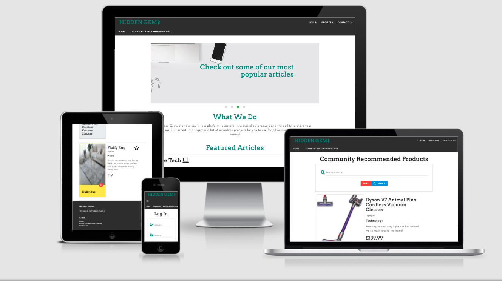
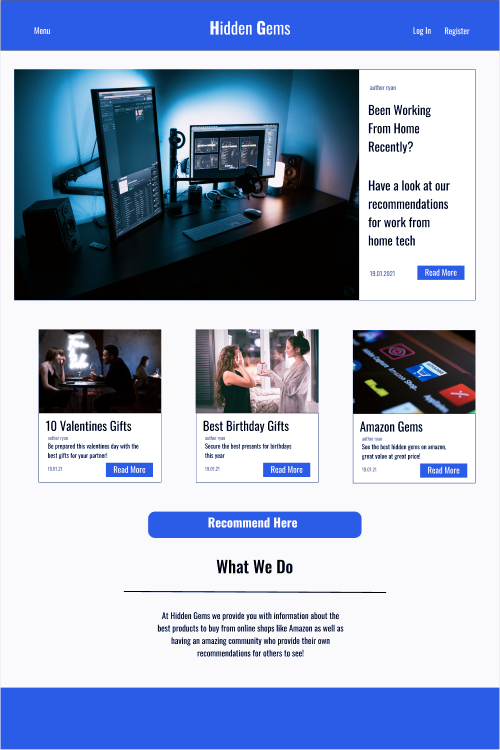
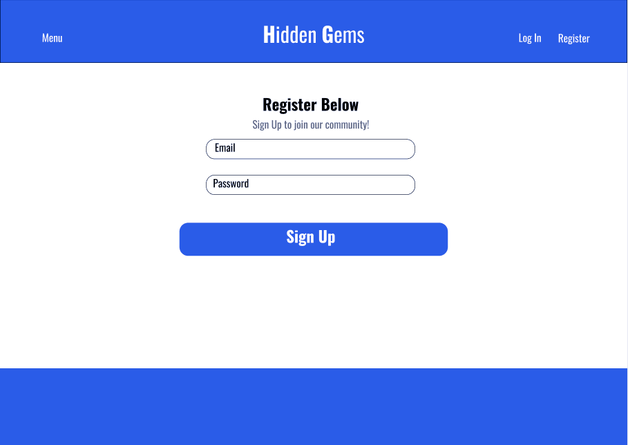
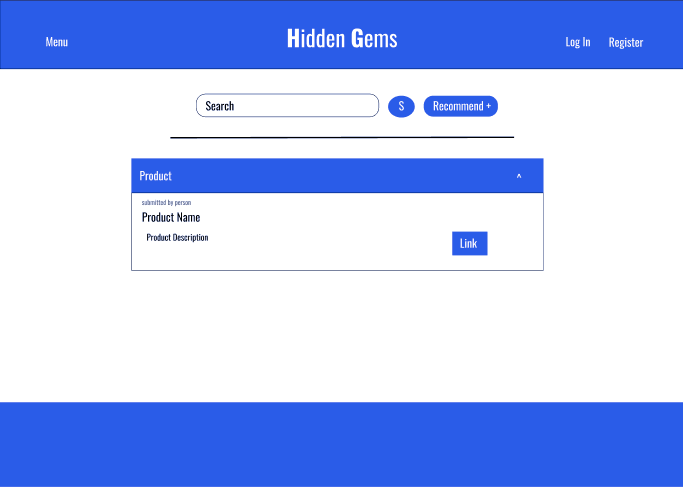
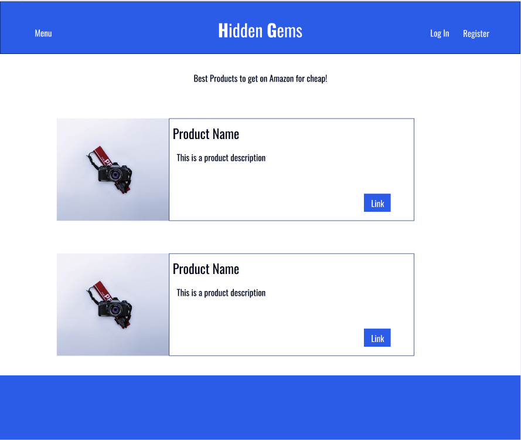
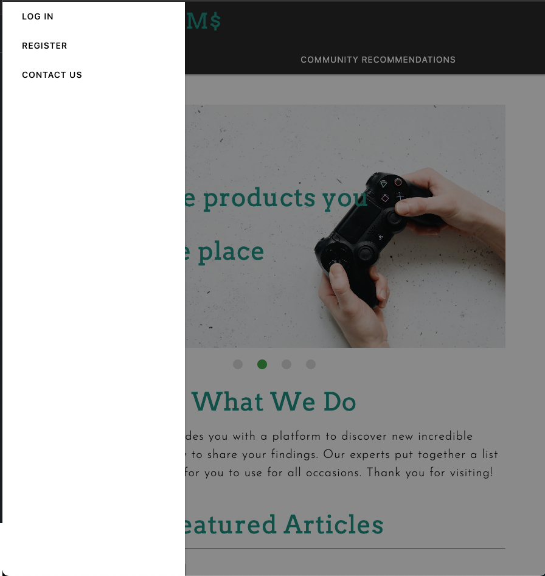
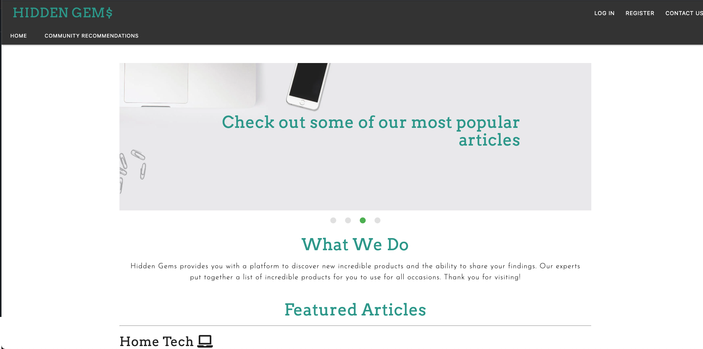

# Hidden Gems: Milestone Project 3

[Live Project](http://hiddengems-milestone3.herokuapp.com/)

# Introduction
Hidden Gems is a site made so that people can join the community and share the products that they love to friends, family and strangers. The site labels products under £20 as a 'Hidden Gem' and provides people with external links to the products.

This is my third Milestone Project of four towards my Full Stack Software Development Course, throughout this project I utilised HTML, CSS, JavaScript and Python, as well as Flask, Materialize and JQuery Frameworks and Mongo DB to put the whole project together.

# UX

### Goals

* To provide a platform where users are able to upload products along with the image for others too see
* To create an aesthetically pleasing and easy to navigate webpage for the user
* To use Interactive and effective features on my website
* Provide a functioning account creation service for users

### User Stories

1. I am a user wishing to show people my favourite products
1. I am a user looking for gift ideas
1. I am a user wanting to see what members of the hidden gem community recommend to buy specifically in the fitness category 
1. I am a user who wants to search for which phones people recommend on Hidden Gems
1. I am a user looking to see what experts recommend I should buy for my home office
1. I am a user wishing to create an account on Hidden Gems to recommend a product i recently found

### Design Process

1. My process began with creating a wireframe on figma, designing my site with initially a blue colour scheme in mind, I settled on a home page, login/register pages, article pages as well as community recommendations page.
1. Throughout my design process my colours used were changed to the following:  
  Black (Used for navigation and footer bars) 
  Teal (Used for higlight text and most buttons) 
  White (Used for navigation text and footer text) 
  Black  (Used for general text on the page) 
After some experimentation and changes throughout the design and building process these were the colours that I decided look the best, the fonts I used were the following: 
  Arvo  
  Josefin  
  Karla  
1. I made a wireframe for my project using FIGMA. I made the design aesthetically pleasing and made sure it was easy to navigate through. I first made my desktop page and then made my mobile layout. Throughout the process of building my website I made a few changes and additions based off of my experience as well as input from family and friends
1. Some of the changes I made included editing the layout of the page, customising features on the site too

# [Figma Wireframe](https://www.figma.com)
> This includes the wireframes for both desktop and mobile device layouts

Throughout the process of coding my website and input from other people, a few improvements were made to the website to not only make it look more professional but also to include more useful features.

# Features

### Features throughout page
* Collapsible Navigation Bar which is stuck to the top of the page, once collapsed side nav becomes available
* When Logged in or Logged Out different options are available in the menu to click on
* Unable to visit register or login page when a user is in session, any attempt will redirect to the home page

### Nav Bar
* Collapsable Nav Bar
* Different menu options available when logged in
* Side Nav when collapsed

### Hero Section
* Image carousel automatically switching every few seconds
* Overlay text sliding in from different directions after each image change

### User Session
* Using Mongo DB to have a user register and login feature
* Certain pages arent available when logged in and logged out
* Unable to register an account which is already in the database

### Community Recommendation
* Users can submit their own recommendations
* All fields must be filled, validated using WTForms
* User pastes in image address
* If item is under £20, product is marked as a hidden gem, box turns yellow with star

### Contact Form
* Email js api used
* Checks all fields are filled before allowing to submit
* Page refreshes afterwards
* Functional contact form which sends email to my account, showing who sent the email

### Admin
* As admin you are able to delete any recommendations people have made
* As admin can also add new categories for products that people may want to recommend
* Admin username: Admin
* Admin Password: Password

### Security
* As passwords were being saved, I used Werkzeug to encrypt passwords to my database
* Protects users passwords from being revealed if site was to be hacked
* WTForms used to prevent people from editing frontend security and bypassing
* Backend Python used to redirect if user is logged in so cant access register or login pages and if user isnt logged in cant access profile or recommend product pages

# Technologies Used

### Languages
* HTML5
  * Base language for the project used to add content to the website
* CSS3 
  * Used to style content
* JavaScript
  * Used to add Interactive features to webpage
* Python
  * Used for Backend programming
  
  
### Technologies
* [Materialize Framework](https://materializecss.com/)
  * Used Materialize's for features suh as my navbar, layout, carousels, buttons, footer and forms
* [FontAwesome](https://fontawesome.com)
  * Used for social links in footer, hero image, navbar and back to top button
* [Google Fonts](https://fonts.google.com)
  * Used Arvo, Josefin and Karla
* [Google Images](https://www.google.co.uk/imghp?hl=en&tab=wi&authuser=0&ogbl)
  * Used for all of my images, each was checked to be copyright free
* [W3 Schools](https://www.w3schools.com)
  * Used for help with the code in my project, I found it very useful for my form and gallery page
* [W3C Markup Validation](https://validator.w3.org)
  * Used this to check that my HTML and CSS code were both valid throughout my project
* [Stack Overflow](https://stackoverflow.com)
  * I used this to help me with small issues I encountered when writing my code
  
  
# Testing

### Testing User Stories

1. User wanted to show off their favourite products, was able to fill out form after registering and uploaded their favourite hoover from amazon
1. User looking for new gift ideas went onto site and clicked on community recommendations tab, then scrolled through to see if they liked any recommendations 
1. User wanted to see items specifically related to fitness, they clicked on community recommendations and typed fitness into the search bar which displayed specific results
1. User went onto community recommendations page and searched for phones and results displayed all the mobile phone results
1. User wanted to see expert recommendations so went onto homepage and clicked on the article for home office, which displayed list of office items recommended by the experts at Hidden Gems
1. User wanted to recommend their favourite items, they registered a new account then went to recommend product tab and filled in the form

### Testing Devices

My webpage was tested using Google Developer Tools to see if it's responsive. All devices were tested successfully including Iphones, Samsungs and Ipads of different screen sizes

### Validating HTML5 and CSS3 code

My code was tested on the WC3 Validation pages and passed all tests

### Different Browsers

I tested my page on the following browsers and found it worked on all

* Safari
* Chrome
* Firefox

### Issues

During my code I had issues with having custom info windows for my Google Maps API and the code for my Read More buttons did not pass the WC3 Validator. These issues were overcome by trial and error with the code myself.

# Deployment

### Deploying

I created my Milestone project using the GitPod environment and pushing it to Github after completing each section, this made sure that my project had good version control in place in case I needed to change some of the work. To create a live version of my project for people to view I did the following:

* Went to my Milestone Project repository on GitHub
* Went to settings and scrolled down to GitHub Pages
* Selected the master branch as source which then gave me the link to include in my ReadMe for people to view
* You can view my project here: [Madrid](https://ryanjbm.github.io/Milestone-Project-2/)

To run locally, you can clone this repository directly into the editor of your choice by pasting git clone https://github.com/ryanjbm/Milestone-Project-2.git into the terminal. To cut ties with this GitHub repository, type git remote rm origin into the terminal.

# Credits

### Content

The content of my website was written by me, however names and locations of places are real.

### Media

Images I used were free to use but came from the following websites:

* [Google Images](https://www.google.co.uk/imghp?hl=en&tab=wi&authuser=0&ogbl)

Code snippets that I used for my read more buttons scrolling text came from the following website:

* [StackOverflow](https://stackoverflow.com)

### Acknowledgments

# Pages for information

* [Stack Overflow](https://stackoverflow.com)
* [W3schools](https://www.w3schools.com)
* [W3c](https://validator.w3.org)
* [Bootstrap](https://getbootstrap.com)

Thank you to the following for the support on issues and for offering advice on my project throughout:
* Code Institute Mentor Brian Macharia
* Code Institute Tutor
* Code Institute Slack Community
* Family and friends for constructive criticism

  
